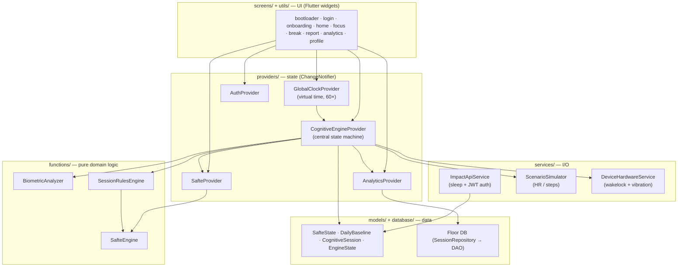
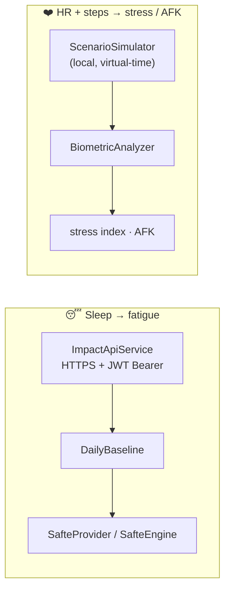
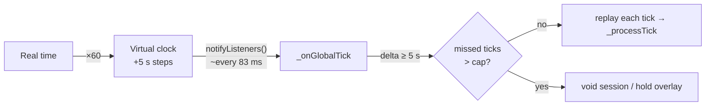
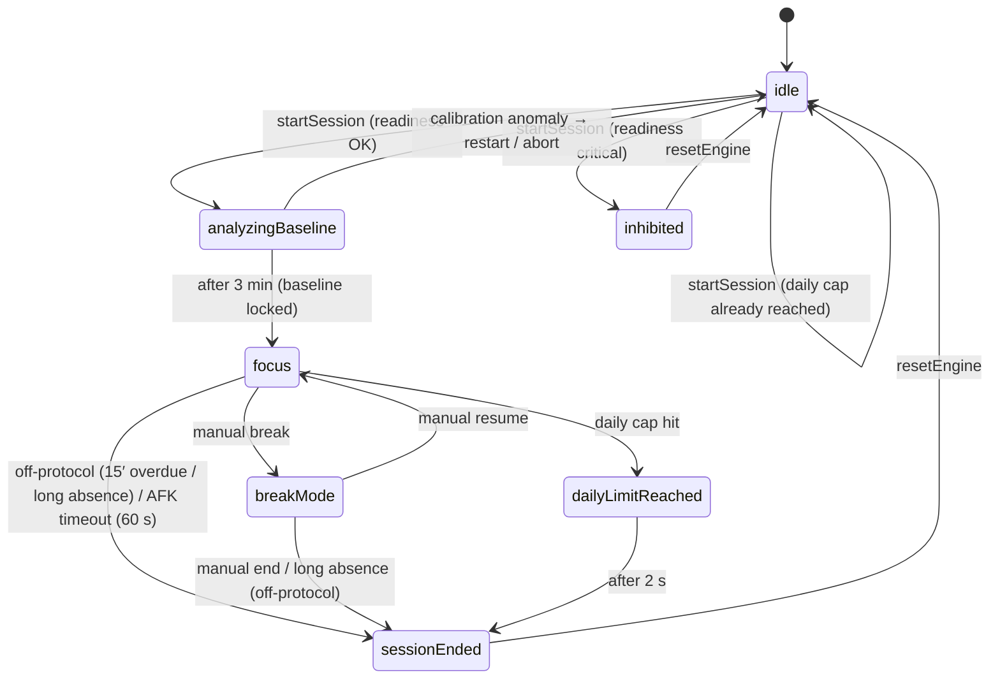
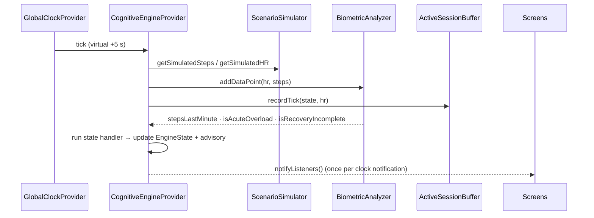

# Focusmaxxer — Architecture

Focusmaxxer is a Flutter app that recommends **focus / break** cycles for deep work by
combining two signals:

1. **Sleep‑driven fatigue** via the biomathematical **SAFTE** model (a cognitive
   *reservoir* that depletes while awake and refills during sleep, modulated by a
   circadian rhythm).
2. **Real‑time physiological stress** derived from heart rate (HR) and steps.

The app runs on an **accelerated virtual clock (60×)** so a full focus/break lifecycle can
be demonstrated in minutes. HR/steps are produced by a local **scenario simulator** (not a
real wearable), while sleep data comes from an external HTTP API.

---

## 1. Layers

State management is **Provider**. Domain logic is isolated in pure, Flutter‑free functions
so it stays testable. Dependencies point downward only.



**Reading rule:** `functions/` never imports Flutter. `providers/` coordinate. `screens/`
only read providers and render. Shared constants live in `lib/app_constants.dart`.

---

## 2. Data sources (mind the mapping)

The two signals come from **completely different places** — a frequent source of confusion.



| Signal | Source | Fetched | Layer |
|--------|--------|---------|-------|
| Sleep (bedtime, wake, efficiency) | External **HTTP API** (JWT), 2‑day data lag | Once, at **boot** (`bootloader_screen`) | `services/impact_api_service.dart` |
| Heart rate + steps | **Local simulator** (function of virtual time) | Every tick | `services/simulator_service.dart` |

---

## 3. Time & tick model

`GlobalClockProvider` is the single time source. It advances virtual time at **60×** real
time in **5‑second** virtual steps, so it notifies listeners roughly every **83 ms** of real
time. It is lifecycle‑aware: it pauses in the background and fast‑forwards on resume so the
fatigue model reflects the real elapsed gap.

`CognitiveEngineProvider` subscribes to the clock. On each notification it computes how many
whole ticks have elapsed and **replays** them (catch‑up), capped at `maxCatchupTicks`
(30 virtual minutes, applied to both focus and break). A larger jump means a long absence: a
running focus/break session is voided (off‑protocol), while during calibration the anomaly
overlay is held instead.



The resolution constant `tickDurationSeconds = 5` is shared (`app_constants.dart`) by the
engine and the `BiometricAnalyzer` (which sizes its sliding windows in ticks).

---

## 4. Engine state machine

`CognitiveEngineProvider` is the central coordinator. `EngineState` (defined in
`models/engine_state.dart`, with the same map documented on the enum) captures the lifecycle
where the sleep‑SAFTE and HR‑stress signals converge.



- **analyzingBaseline** — capturing the calm resting HR to set the per‑session baseline.
- **inhibited** — focus refused because SAFTE readiness is critically low.
- **dailyLimitReached** — the 4‑hour daily deep‑work cap (`SessionRulesEngine.dailyMaxSeconds`).
- **AFK during analyzingBaseline is not a timeout** — unlike in `focus`, an AFK/anomaly
  during calibration holds the "calibration failed" overlay open (the tick loop never
  auto‑dismisses it); the user resolves it by restarting or aborting, both landing back in
  `idle`.
- **breakMode has no AFK detection** — neither movement (steps) nor backgrounding raises the
  AFK overlay during a break, so the user may step away freely. The only involuntary exit is
  the catch‑up cap: a background→resume gap beyond 30 virtual minutes voids the break as
  off‑protocol (same rule as focus).

---

## 5. Core data flow (one tick)

What happens on every processed tick, end to end:



**Not per tick:** the segment durations come from `SessionRulesEngine.calculateNextSegment`
(which reads the SAFTE readiness via `SafteProvider.getStateAt`) and are computed only at
**segment boundaries** — `startSession` and `manualTransitionToFocus` — not inside the tick
loop. The `BiometricAnalyzer` derivations above are consulted by the active state handler.

When a session ends and is **validated** (> 10 min of focus), the volatile
`ActiveSessionBuffer` is frozen into a `CognitiveSession` and persisted once (idempotently)
via `AnalyticsProvider` → `SessionRepository` → Floor DAO.

---

## 6. Domain glossary (canonical vocabulary)

These terms are used identically across code, comments, and this document.

| Term | Meaning | Where |
|------|---------|-------|
| **Reservoir** `R(t)` | Homeostatic cognitive reserve (0…`maxReservoirCapacity`). | `SafteEngine` |
| **Circadian** `C(t)` | Time‑of‑day modulator (two harmonics). | `SafteEngine` |
| **Effectiveness / Readiness** | Final SAFTE score (0–100%) shown in the UI. | `SafteState.effectiveness` |
| **Baseline** | Per‑session resting HR mean/σ from the calm start. | `BiometricAnalyzer` |
| **Stress index** | 0–1 acute‑overload measure (Z‑score, m‑out‑of‑n rule). | `BiometricAnalyzer` |
| **AFK** | Away‑from‑keyboard, from steps or backgrounding. | `CognitiveEngineProvider` |
| **Termination reason** | Why a session ended (storage contract). | `TerminationReasons` |
| **EngineState** | Lifecycle state of the session state machine. | `models/engine_state.dart` |

---

## 7. Where things live

```
lib/
  main.dart                    # MultiProvider DI graph (entry point)
  app_constants.dart           # cross-layer shared constants (tick resolution)
  functions/                   # PURE domain: safte_engine, biometric_analyzer,
                               #   session_rules_engine, termination_reason
  providers/                   # state machines: clock, cognitive_engine, safte,
                               #   auth, analytics
  services/                    # I/O: impact_api (sleep+JWT), simulator (HR/steps),
                               #   device_hardware
  models/                      # data: safte_state, daily_baseline, session_data,
                               #   engine_state, onboarding_data
  database/                    # Floor: app_database(.g), session_dao, session_repository
  screens/ (+ tabs/)           # UI: bootloader, login, onboarding, home, focus,
                               #   break, report, analytics, profile
  utils/                       # theme + reusable UI (ambient_glow, duration_format,
                               #   termination_badge, biometric_ring, ...)
```
