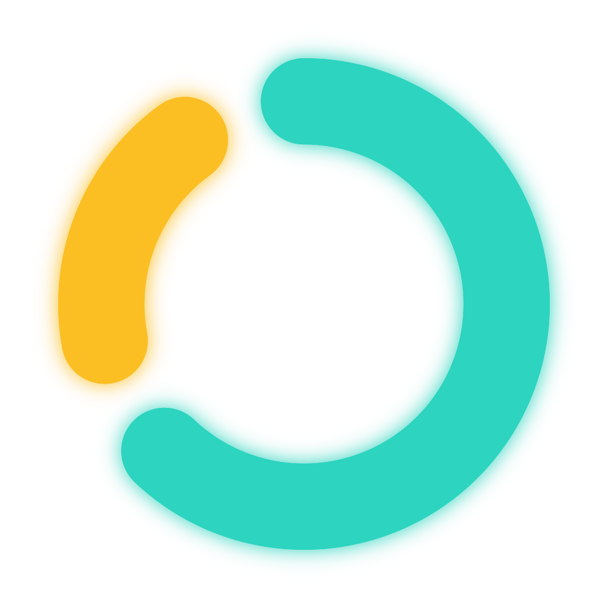

<div align="center">



# FocusMaxxer

**Deep-work sessions timed by your cognitive readiness, not a fixed clock.**

`Flutter` · `Dart 3.11+` · `Provider` · `Floor (SQLite)` · **Status: frozen concept**

</div>

---

> [!IMPORTANT]
> **Project status — read this first.**
> - FocusMaxxer is a **finished academic project, currently frozen**. It is a *concept /
>   demonstrative prototype* — well beyond an MVP in polish and depth, but not a shipping product.
> - Biometrics (heart rate, steps) are **simulated locally**, not read from a real wearable.
> - The central fatigue algorithm is a **research model, not clinically validated**. It is **not**
>   intended for medical use or real health decisions.

---

## What it is

Unlike a fixed Pomodoro timer, FocusMaxxer's thesis is that the *right* moment and the *right*
length for focused work are **not constant** — they depend on your current **cognitive
readiness**. The app estimates that readiness by fusing two independent signals:

- **Sleep-driven fatigue** — how rested your brain is, from the biomathematical **SAFTE** model fed by real sleep data.
- **Biometric stress** — how strained your body is *right now*, derived statistically from heart-rate and step streams.

It turns that into a concrete recommendation: *focus now for N minutes, then rest for M* — or
*don't start, you're too fatigued.*

## Key features

- **Adaptive focus/break durations** from a biomathematical fatigue model (SAFTE readiness, 0–100%).
- **Live biometric stress detection** — a per-session HR baseline, a Z-score density stress index, and an acute-overload fail-safe that forces a break.
- **Guided recovery breaks** with a breathing pacer and vagal-tone-based auto-extension when the body hasn't recovered.
- **Strict-mode session integrity** — AFK detection (steps + backgrounding), off-protocol escalation, and a hard **4-hour daily cap**.
- **Session history & report** — an HR-timeline chart (`fl_chart`) with focus/recovery band shading, plus a browsable, deletable history.
- **Compressed virtual clock (60×)** so a full day of fatigue dynamics plays out in minutes — ideal for demos.

## Screenshots

**[See the full visual walkthrough → GALLERY.md](GALLERY.md)** — every screen in session
order (sign-in → dashboard → calibration → deep focus → stress → overload → recovery →
debrief → history), with the focus ring's color-coded states explained.

## What's real vs. simulated

A defining fact about the app: its two signals come from different worlds.

| Signal | Source | Status |
|---|---|---|
| Sleep / SAFTE input | IMPACT REST backend (University of Padova), JWT-authenticated | **Real** network call, fetched once at boot (with a synthetic fallback) |
| Heart rate + steps | Local deterministic simulator (`ScenarioSimulator`) | **Simulated** — stands in for a wearable device |

Replacing that simulator with a genuine wearable is the first prerequisite for any future
productization (see [Roadmap](#roadmap--toward-a-real-product)).

## How it works (at a glance)

The domain logic lives in three pure, deterministic engines (`lib/functions/`):

- **`safte_engine`** — tracks a cognitive *reservoir* that drains awake and refills during sleep, modulated by a circadian rhythm, to produce a 0–100% *readiness* score.
- **`biometric_analyzer`** — turns the HR/steps stream into a stress index and AFK detection, against a calm per-session baseline.
- **`session_rules_engine`** — maps readiness to the ideal focus/break durations for the next segment.

These converge in `CognitiveEngineProvider`, the central state machine, driven tick-by-tick by a
virtual clock (5 s tick, 60× speed).

> For the full derivation — every formula, constant, and threshold with `file:line` references —
> see **[docs/ARCHITECTURE.md](docs/ARCHITECTURE.md)**. UI internals are documented in
> **[docs/UI_INTERNALS.md](docs/UI_INTERNALS.md)**.

## Tech stack

- **UI & state management** — Flutter (Dart SDK `^3.11`), [Provider](https://pub.dev/packages/provider) (`ChangeNotifier`, consumed via `watch`/`read`/`select`).
- **Persistence** — [Floor](https://pub.dev/packages/floor) + [sqflite](https://pub.dev/packages/sqflite) for session history; [shared_preferences](https://pub.dev/packages/shared_preferences) for counters, biological anchors, and tokens.
- **Networking / auth** — [http](https://pub.dev/packages/http) + [jwt_decoder](https://pub.dev/packages/jwt_decoder) for the IMPACT sleep backend (JWT Bearer).
- **Presentation** — [fl_chart](https://pub.dev/packages/fl_chart) (HR report), [google_fonts](https://pub.dev/packages/google_fonts), [wakelock_plus](https://pub.dev/packages/wakelock_plus) (keep-awake), [vibration](https://pub.dev/packages/vibration) (haptics).
- **Tooling** — `flutter_lints`, `floor_generator` + `build_runner` (codegen), `flutter_launcher_icons`.

## Project structure

```
lib/
  main.dart              # MultiProvider root + dependency-injection wiring
  app_constants.dart     # shared domain constants (e.g. tickDurationSeconds)
  providers/             # ChangeNotifier state: auth, safte, clock, analytics, cognitive_engine
  services/              # impact_api (sleep + auth), simulator (HR/steps), device_hardware
  functions/             # pure domain logic: safte_engine, biometric_analyzer, session_rules_engine
  models/                # daily_baseline, safte_state, session_data, engine_state, onboarding_data
  database/              # Floor: app_database, session_dao, session_repository
  screens/ (+ tabs/)     # bootloader, login, onboarding, dashboard, focus/break mode, report, profile
  utils/                 # theme + reusable UI components and helpers
```

## Getting started

**Prerequisites**

- A recent [Flutter SDK](https://docs.flutter.dev/get-started/install) (Dart `^3.11`).
- A **physical Android device** — the project targets physical devices (there is no emulator flow).

**Run**

```bash
flutter pub get
dart run build_runner build --delete-conflicting-outputs   # Floor codegen (app_database.g.dart)
flutter devices                                            # find your <device-id>
flutter run -d <device-id>
```

Static analysis targets zero issues:

```bash
flutter analyze
```

**A note on login.** Sign-in authenticates against the IMPACT backend
(`https://impact.dei.unipd.it/bwthw/`) and requires a University-of-Padova study account. Sleep
data is served with a **2-day lag**, so the app requests the record from two days ago. If the
backend is unreachable or the response is malformed, the boot fetch **falls back to a synthetic
mock baseline**, so you can still exercise the full flow end-to-end offline.

## Try the demo scenarios (Developer Tools)

Because there is no real sensor, the app ships with a **developer panel** (reachable from the
Profile screen) that makes the engine fully demonstrable:

- **Simulation speed** — presets `1× / 2× / 10× / 60×` to slow the clock down and watch the ring
  evolve, or fast-forward through a whole session.
- **Active scenario** — five curated biometric storylines, switchable on the fly:

| Scenario | What it demonstrates |
|---|---|
| `steadyFocus` | Calm HR, full recovery — a normal focus/break cycle (default). |
| `stressPeaks` | Two post-calibration HR peaks — the ring drifts amber, then snaps red at the acute-overload fail-safe. |
| `partialRecovery` | Break HR settles late — one incomplete-recovery warning + an auto-extension. |
| `failedRecovery` | Break HR never settles — extensions until max break, then the session ends on neural fatigue. |
| `taskAbandonment` | User walks away — exercises AFK / movement detection and auto-resume. |

## Roadmap — toward a real product

The app is intentionally frozen. Two changes are hard prerequisites before it could become
anything more than a concept:

1. **Real wearable integration** — replace the local `ScenarioSimulator` with heart-rate and step
   data from an actual device.
2. **A validatable core algorithm** — replace the current research fatigue model with a genuinely
   validatable, clinically-grounded one.

Beyond that, a known pre-commercialization hardening item: JWT tokens are currently stored in
`shared_preferences` in **plaintext** and would need to move to secure/encrypted storage.

## Documentation

- **[docs/ARCHITECTURE.md](docs/ARCHITECTURE.md)** — the domain & architecture reference: the scientific models, the state machine, data sources, persistence, and security posture, all traceable to `file:line`.
- **[docs/UI_INTERNALS.md](docs/UI_INTERNALS.md)** — UI internals and presentation details.

## Status & license

No open-source license is attached. FocusMaxxer is a personal academic concept/prototype shared
for demonstration — it is **not** licensed for reuse, redistribution, or commercial use.
