# FocusMaxxer — Visual walkthrough

A screen-by-screen tour of one adaptive deep-work session, in the order you'd actually
experience it. Back to the [README](../README.md).

> The heart-rate and step data shown here are produced by the built-in **simulator**
> (`steadyFocus` / `stressPeaks` scenarios), not a real wearable — see the
> [architecture reference](ARCHITECTURE.md) for how each number is derived.

---

## 1. Sign in

Authenticate against the IMPACT sleep backend. If the backend is unreachable, boot falls
back to a synthetic sleep baseline so the app still runs end-to-end.

  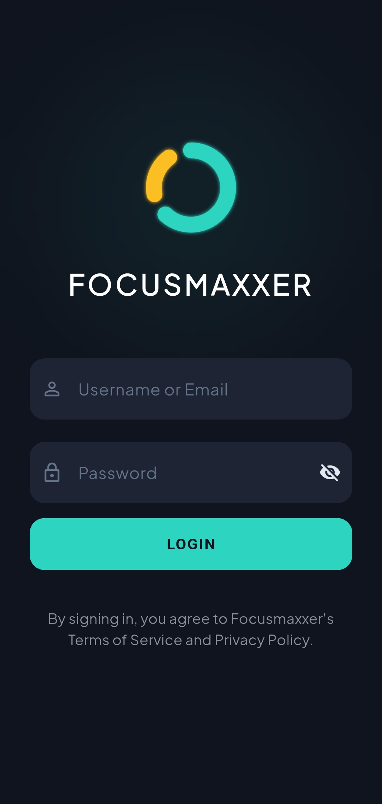

---

## 2. The dashboard

Your **cognitive readiness** (0–100%) is the headline number, driven by the SAFTE fatigue
model. Below it, the daily deep-work bar tracks progress toward the 4-hour cap, and the
**SAFTE components** break the score down into its three drivers — reservoir, circadian
phase, and sleep inertia. The START button only unlocks when readiness clears the gate.

<table>
  <tr>
    <td align="center">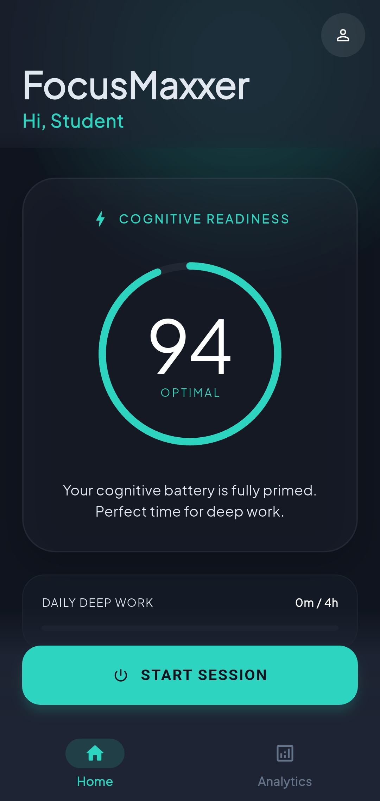</td>
    <td align="center">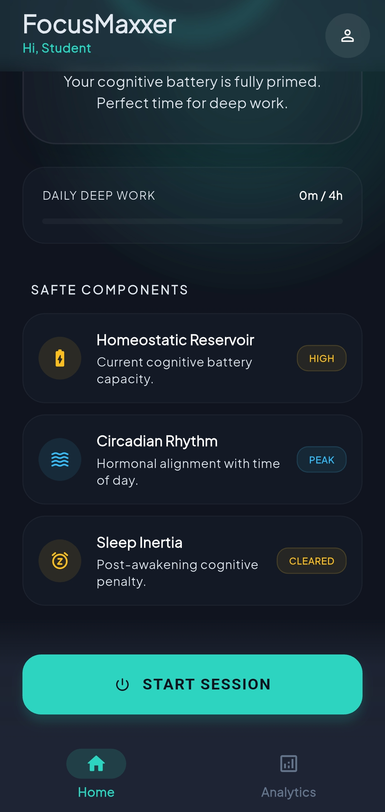</td>
  </tr>
  <tr>
    <td align="center"><b>Cognitive readiness</b> — 94, <i>Optimal</i></td>
    <td align="center"><b>SAFTE components</b> — reservoir · circadian · inertia</td>
  </tr>
</table>

---

## 3. A focus session — the ring speaks

The focus ring's **fill** is your progress through the segment; its **color** is the live
engine state. This is the app's signature idea — the color *is* the biometric stress index:

| Color | State |
|:--|:--|
| 🔵 Blue | **Calibrating** — learning your calm HR baseline (controls locked) |
| 🟢 Teal | **Deep focus** — settled, on protocol |
| 🟡 Amber | **Stress rising** — HR drifting above baseline |
| 🔴 Red | **Acute overload** — sustained stress; a break is forced |

<table>
  <tr>
    <td align="center">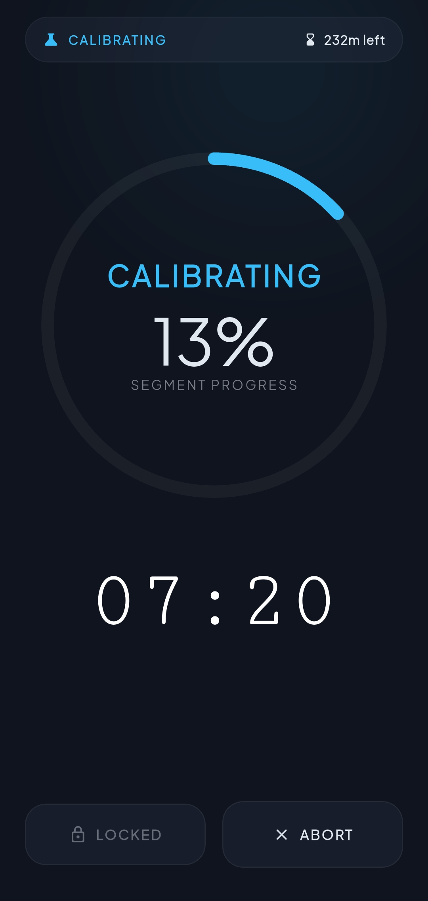</td>
    <td align="center">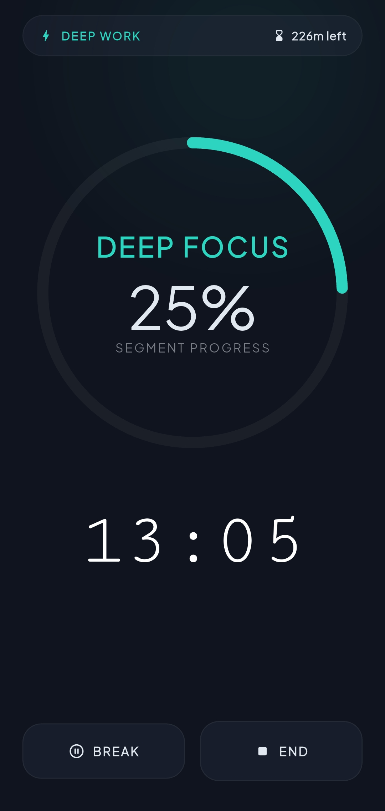</td>
  </tr>
  <tr>
    <td align="center"><b>Calibrating</b> (blue)</td>
    <td align="center"><b>Deep focus</b> (teal)</td>
  </tr>
  <tr>
    <td align="center">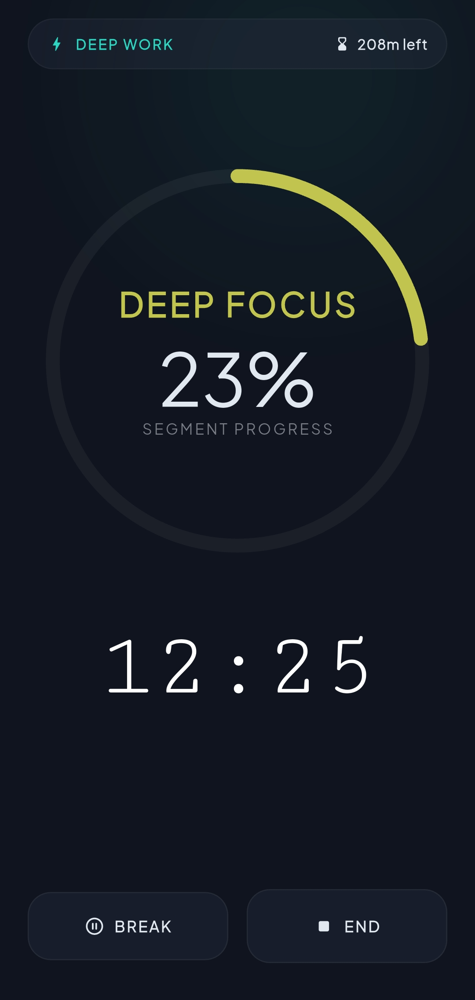</td>
    <td align="center">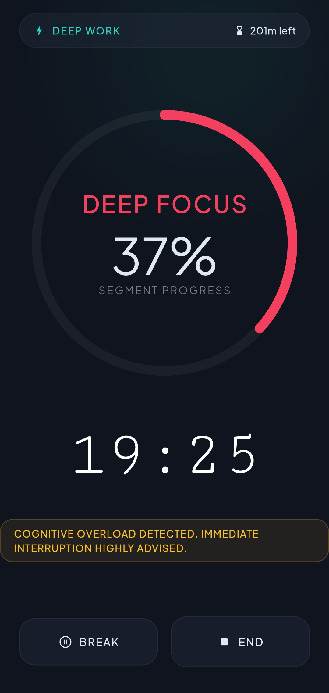</td>
  </tr>
  <tr>
    <td align="center"><b>Stress rising</b> (amber)</td>
    <td align="center"><b>Cognitive overload</b> (red) — break advised</td>
  </tr>
</table>

---

## 4. Guided recovery

The break is a guided recovery, not a plain timer. The engine judges whether your body has
actually recovered (vagal-tone proxy): while recovery is incomplete, **RESUME stays locked**
and the break auto-extends; once your tone is restored, it clears you for the next segment.

<table>
  <tr>
    <td align="center">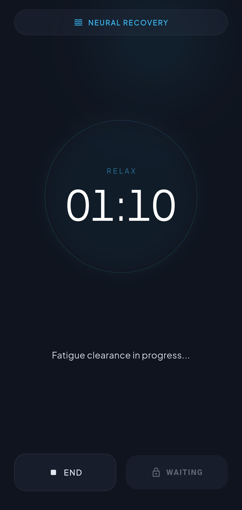</td>
    <td align="center">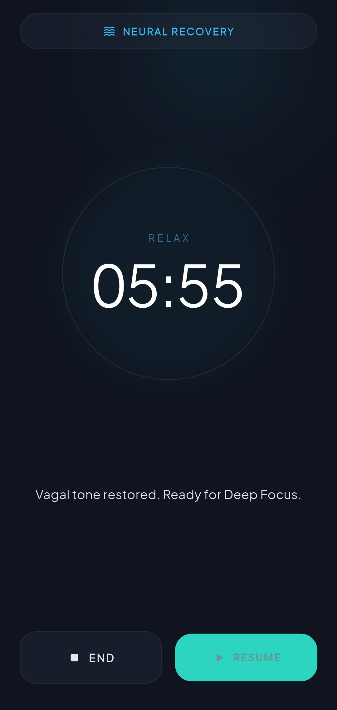</td>
  </tr>
  <tr>
    <td align="center"><b>Incomplete</b> — <i>fatigue clearance in progress</i>, RESUME locked</td>
    <td align="center"><b>Complete</b> — <i>vagal tone restored</i>, ready to resume</td>
  </tr>
</table>

---

## 5. Debrief & history

Every ended session opens a debrief: total deep-work time, recovery minutes, average HR, and
a heart-rate timeline shaded by phase. All validated sessions are stored and browsable in
Analytics, each tagged with how it ended.

<table>
  <tr>
    <td align="center">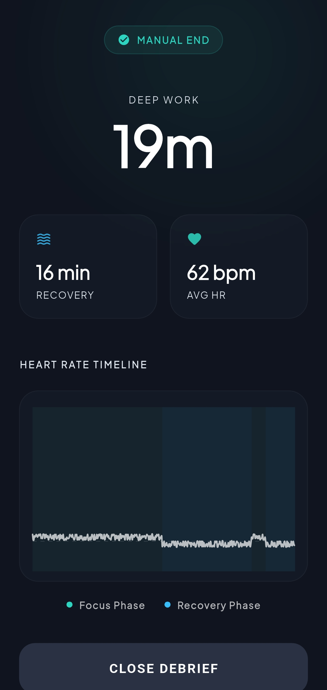</td>
    <td align="center">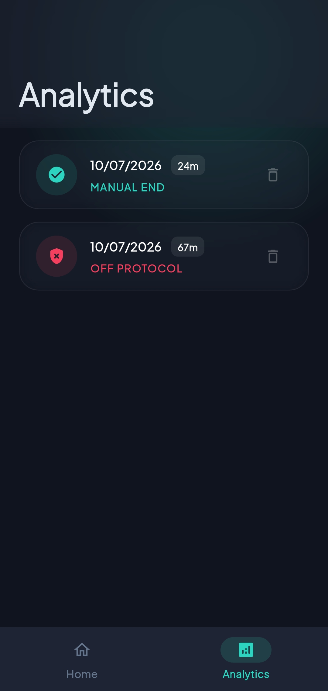</td>
  </tr>
  <tr>
    <td align="center"><b>Session debrief</b> — HR timeline, focus vs. recovery</td>
    <td align="center"><b>Analytics</b> — history with termination badges</td>
  </tr>
</table>

---

## 6. Developer tools

Because biometrics are simulated, the Profile screen exposes a small control surface that
makes the whole engine demonstrable: **Simulation Speed** (1× / 2× / 10× / 60×) and the
**Active Scenario** picker that swaps the biometric storyline on the fly.

  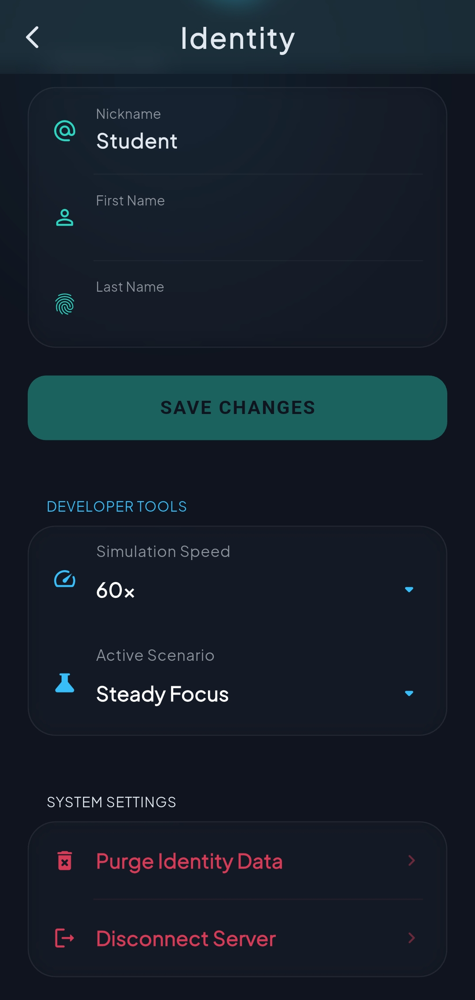

---

Back to the [README](../README.md) · Architecture deep-dive in
[ARCHITECTURE.md](ARCHITECTURE.md).
